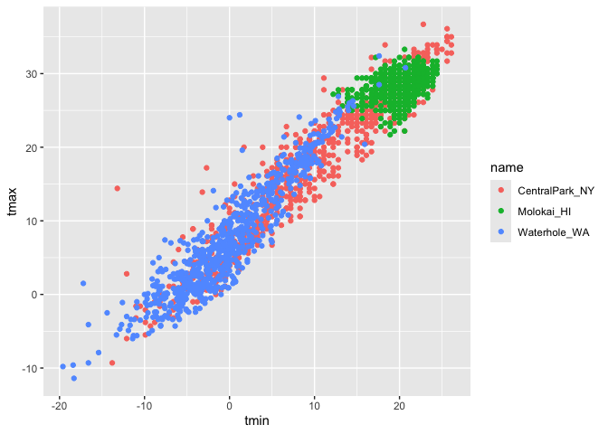
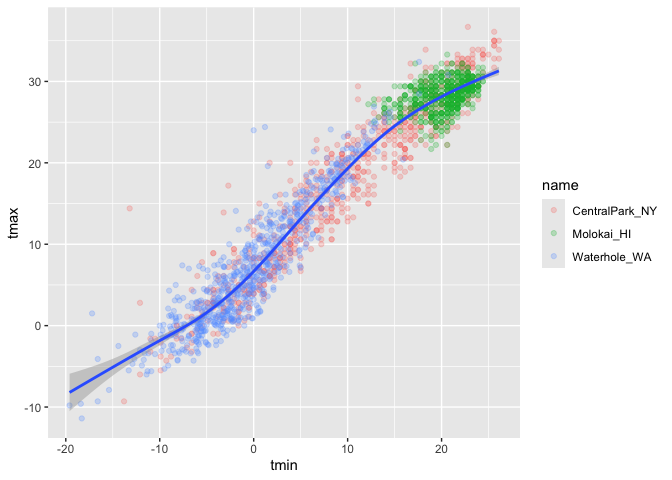
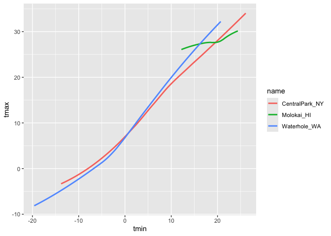
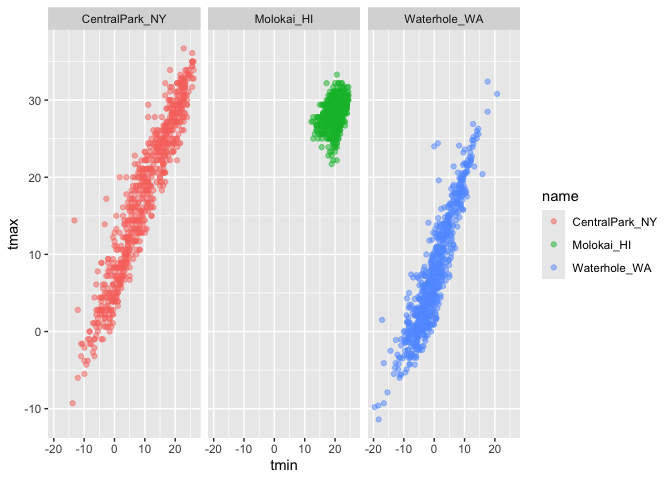
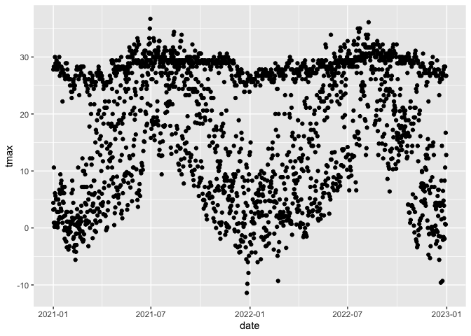
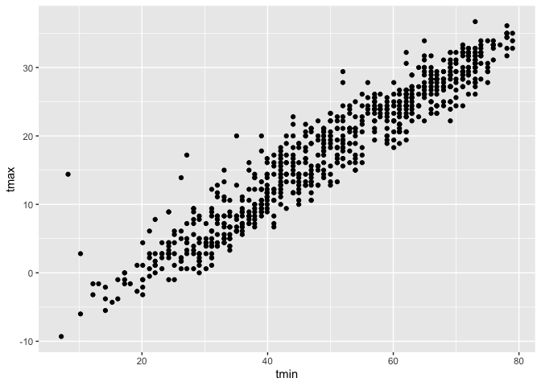

Visualization
================
2026-10-01

# Visualization and EDA

This is visualization

``` r
library(tidyverse)
```

    ## ── Attaching core tidyverse packages ──────────────────────── tidyverse 2.0.0 ──
    ## ✔ dplyr     1.2.1     ✔ readr     2.2.0
    ## ✔ forcats   1.0.1     ✔ stringr   1.6.0
    ## ✔ ggplot2   4.0.3     ✔ tibble    3.3.1
    ## ✔ lubridate 1.9.5     ✔ tidyr     1.3.2
    ## ✔ purrr     1.2.2     
    ## ── Conflicts ────────────────────────────────────────── tidyverse_conflicts() ──
    ## ✖ dplyr::filter() masks stats::filter()
    ## ✖ dplyr::lag()    masks stats::lag()
    ## ℹ Use the conflicted package (<http://conflicted.r-lib.org/>) to force all conflicts to become errors

``` r
library(ggridges)
```

``` r
library(p8105.datasets)
data("weather_df")
```

Now we have everything we need!

``` r
weather_df
```

    ## # A tibble: 2,190 × 6
    ##    name           id          date        prcp  tmax  tmin
    ##    <chr>          <chr>       <date>     <dbl> <dbl> <dbl>
    ##  1 CentralPark_NY USW00094728 2021-01-01   157   4.4   0.6
    ##  2 CentralPark_NY USW00094728 2021-01-02    13  10.6   2.2
    ##  3 CentralPark_NY USW00094728 2021-01-03    56   3.3   1.1
    ##  4 CentralPark_NY USW00094728 2021-01-04     5   6.1   1.7
    ##  5 CentralPark_NY USW00094728 2021-01-05     0   5.6   2.2
    ##  6 CentralPark_NY USW00094728 2021-01-06     0   5     1.1
    ##  7 CentralPark_NY USW00094728 2021-01-07     0   5    -1  
    ##  8 CentralPark_NY USW00094728 2021-01-08     0   2.8  -2.7
    ##  9 CentralPark_NY USW00094728 2021-01-09     0   2.8  -4.3
    ## 10 CentralPark_NY USW00094728 2021-01-10     0   5    -1.6
    ## # ℹ 2,180 more rows

lets make a scatter plot! aes限定你的x軸要放什麼，然後y軸要放什麼

``` r
ggplot(weather_df, aes(x = tmin, y = tmax)) +
  geom_point()
```

    ## Warning: Removed 17 rows containing missing values or values outside the scale range
    ## (`geom_point()`).

<!-- -->
geom point可以做點狀圖

I always like the dataframe first

``` r
gg_temp_scatterpolot=
weather_df |>
  ggplot(aes(x = tmin, y = tmax)) + 
  geom_point()
gg_temp_scatterpolot
```

    ## Warning: Removed 17 rows containing missing values or values outside the scale range
    ## (`geom_point()`).

<!-- -->
和上面的步驟是一樣的，只是告訴R你要放圖在哪個dataset,但你加上gg_temp_scatterpolot會告訴R，你暫時把圖存放在哪裡

Lets make this a bit fancier…

``` r
weather_df |>
  ggplot(aes(x = tmin, y = tmax)) + 
  geom_point(aes(color = name))
```

    ## Warning: Removed 17 rows containing missing values or values outside the scale range
    ## (`geom_point()`).

<!-- -->
當你加上一些設定之後，你的圖會多一些變化，比如顏色的變化，這個跟你的圖的設定code有關

``` r
weather_df |>
  ggplot(aes(x = tmin, y = tmax)) + 
  geom_point(aes(color = name), alpha=.25) +
  geom_smooth()
```

    ## `geom_smooth()` using method = 'gam' and formula = 'y ~ s(x, bs = "cs")'

    ## Warning: Removed 17 rows containing non-finite outside the scale range
    ## (`stat_smooth()`).

    ## Warning: Removed 17 rows containing missing values or values outside the scale range
    ## (`geom_point()`).

<!-- -->
geom_smooth()的()裡面 通常不建議加se =
FALSE，因為容易看到各種斷線，如果不加，就會看到一條完整的線
加上alpha會改變透明度

``` r
weather_df |>
  ggplot(aes(x = tmin, y = tmax,color = name)) + 
  geom_smooth(se = FALSE)
```

    ## `geom_smooth()` using method = 'loess' and formula = 'y ~ x'

    ## Warning: Removed 17 rows containing non-finite outside the scale range
    ## (`stat_smooth()`).

<!-- -->
用geom_smooth可以畫線條圖

show faceting

``` r
weather_df |> 
  ggplot(aes(x = tmin, y = tmax, color = name)) + 
  geom_point(alpha = .5) +
  facet_grid(. ~ name)
```

    ## Warning: Removed 17 rows containing missing values or values outside the scale range
    ## (`geom_point()`).

<!-- -->
facet_grid(. ~ name),裡面的. ~ name代表用這個來做column

``` r
weather_df |> 
  ggplot(aes(x = tmin, y = tmax, color = name)) + 
  geom_point(alpha = .5) +
  facet_grid(cols=vars(name))
```

    ## Warning: Removed 17 rows containing missing values or values outside the scale range
    ## (`geom_point()`).

<!-- -->
facet_grid(cols=vars(name))和facet_grid(. ~ name)的功能是一樣的

lets look at something else

``` r
weather_df |> 
  ggplot(aes(x = date, y = tmax))+
  geom_point()
```

    ## Warning: Removed 17 rows containing missing values or values outside the scale range
    ## (`geom_point()`).

<!-- -->
你的x軸和y軸可以隨著你自己的設定改變

``` r
weather_df |> 
  ggplot(aes(x = date, y = tmax,color=name))+
  geom_point(aes(size=prcp),alpha= .5)+
  geom_smooth(se = FALSE)+
  facet_grid(. ~ name)
```

    ## `geom_smooth()` using method = 'loess' and formula = 'y ~ x'

    ## Warning: Removed 17 rows containing non-finite outside the scale range
    ## (`stat_smooth()`).

    ## Warning: Removed 19 rows containing missing values or values outside the scale range
    ## (`geom_point()`).

<!-- -->
當你在geom_smooth(se = FALSE)，就是在告訴R，你不要有SE在你的圖裡面
然後和上面一樣，你可以加透明度和設定不同的columns

make a plot of central park tmax v tmin only, and convert temperatures
to fahrenheit.

``` r
weather_df |> 
  filter(name=="CentralPark_NY") |> 
  mutate(
    tamx=tmax*(9/5)+32,
    tmin=tmin*(9/5)+32
  ) |> 
  ggplot(aes(x = tmin, y = tmax))+
  geom_point()
```

<!-- -->
當你加上filter和mutate，可以用filter篩選出你要的data，然後mutate可以用來convert你要的公式

whats a hex plot

``` r
weather_df |> 
  ggplot(aes(x = tmax, y = tmin)) + 
  geom_hex()
```

    ## Warning: Removed 17 rows containing non-finite outside the scale range
    ## (`stat_binhex()`).

<!-- -->
如果你要做一個超過2000個data的圖，scatter plot會很messy，用hex會更好
