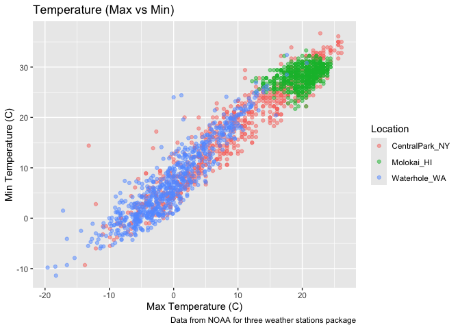
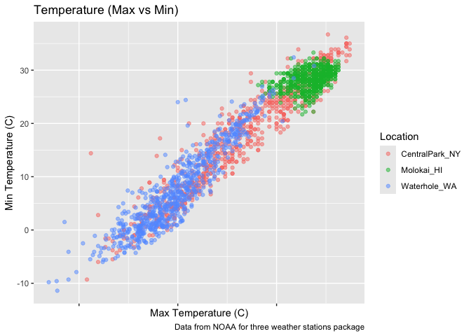
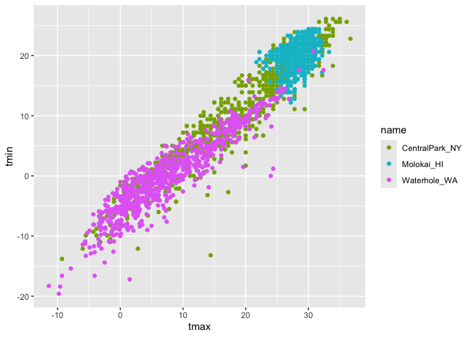
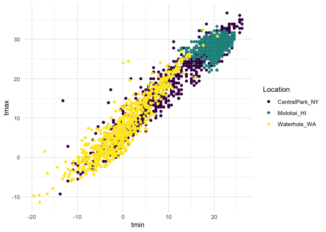
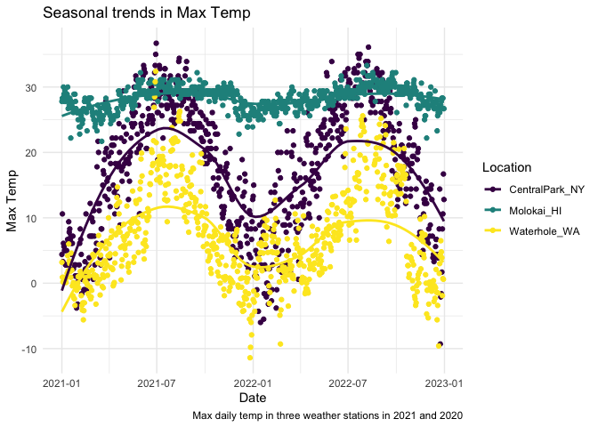
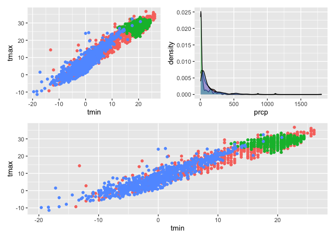
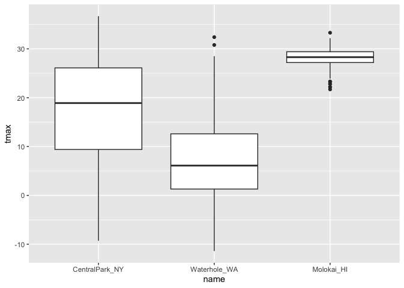

Visualization
================
2026-10-06

# Visualization and EDA

This is visualization

``` r
library(tidyverse)
```

    ## ── Attaching core tidyverse packages ──────────────────────── tidyverse 2.0.0 ──
    ## ✔ dplyr     1.2.1     ✔ readr     2.2.0
    ## ✔ forcats   1.0.1     ✔ stringr   1.6.0
    ## ✔ ggplot2   4.0.3     ✔ tibble    3.3.1
    ## ✔ lubridate 1.9.5     ✔ tidyr     1.3.2
    ## ✔ purrr     1.2.2     
    ## ── Conflicts ────────────────────────────────────────── tidyverse_conflicts() ──
    ## ✖ dplyr::filter() masks stats::filter()
    ## ✖ dplyr::lag()    masks stats::lag()
    ## ℹ Use the conflicted package (<http://conflicted.r-lib.org/>) to force all conflicts to become errors

``` r
library(p8105.datasets)
```

``` r
library(p8105.datasets)
data("weather_df")
```

Now we have everything we need! Start with a scatter plot
你可以使用設定，在圖的表現上，完整呈現你希望展示的東西

``` r
weather_df |> 
  ggplot(aes(x = tmin, y = tmax)) + 
  geom_point(aes(color = name), alpha = .5) + 
  labs(
    title = "Temperature (Max vs Min)",
    x = "Max Temperature (C)",
    y = "Min Temperature (C)",
    color="Location",
    caption = "Data from NOAA for three weather stations package"
  )
```

    ## Warning: Removed 17 rows containing missing values or values outside the scale range
    ## (`geom_point()`).

<!-- -->

let’s try some other scales
當你使用label的時候，你可以改變label,圖片對應的label會改變
你也可以把圖片上的位置進行相應的調整和改變

``` r
weather_df |> 
  ggplot(aes(x = tmin, y = tmax)) + 
  geom_point(aes(color = name), alpha = .5) + 
  labs(
    title = "Temperature (Max vs Min)",
    x = "Max Temperature (C)",
    y = "Min Temperature (C)",
    color="Location",
    caption = "Data from NOAA for three weather stations package"
  )+ 
  scale_x_continuous(
    breaks = c(-15, 0, 15),
    labels = c("-15º C", "0", "Fifteen")+
      scale_y_continuous(
    trans = "sqrt", 
    position = "right")
  )
```

    ## Warning: Removed 17 rows containing missing values or values outside the scale range
    ## (`geom_point()`).

<!-- -->

Lets look at color!
當你不喜歡圖片的顏色的時候，你可以自己改圖片的顏色，用一些設定，去進行相應的改變
scale_color_hue可以用來改變color的scale（？）

``` r
weather_df |> 
  ggplot(aes(x = tmax, y = tmin,color=name)) + 
  geom_point() + 
  scale_color_hue(h = c(100, 300))
```

    ## Warning: Removed 17 rows containing missing values or values outside the scale range
    ## (`geom_point()`).

<!-- -->

當你覺得改顏色不方便的時候，可以用viridis這個package

``` r
weather_df |> 
  ggplot(aes(x = tmax, y = tmin,color=name)) + 
  geom_point() + 
  viridis::scale_color_viridis(
    name = "Location", 
    discrete = TRUE
  )
```

    ## Warning: Removed 17 rows containing missing values or values outside the scale range
    ## (`geom_point()`).

<!-- -->

\##Themes
寫code的時候永遠注意，只要你沒有在ggplot裡面清楚定義你的color代表什麼的話
你的圖，就會變黑白的哈哈哈 加了minimal是老師自己個人偏好的方式（？）

``` r
weather_df |> 
ggplot(aes(x = tmin, y = tmax,color=name)) + 
   geom_point() +
  viridis::scale_color_viridis(
    name = "Location", 
    discrete = TRUE
  )+
  theme(legend.position = "bottom")+
  theme_minimal()
```

    ## Warning: Removed 17 rows containing missing values or values outside the scale range
    ## (`geom_point()`).

<!-- -->

update the tmax vs date plot

``` r
weather_df |> 
ggplot(aes(x = date, y = tmax,color=name)) + 
   geom_point() +
  geom_smooth(se=FALSE)+
  labs(
    title="Seasonal trends in Max Temp",
    x="Date",
    y="Max Temp",
    caption="Max daily temp in three weather stations in 2021 and 2020",
    color="Location"
  )+
  viridis::scale_color_viridis(
    name = "Location", 
    discrete = TRUE
  )+
  theme(legend.position = "bottom")+
  theme_minimal()
```

    ## `geom_smooth()` using method = 'loess' and formula = 'y ~ x'

    ## Warning: Removed 17 rows containing non-finite outside the scale range
    ## (`stat_smooth()`).

    ## Warning: Removed 17 rows containing missing values or values outside the scale range
    ## (`geom_point()`).

<!-- -->

\##Two more weird but useful plot things
你可以做不止一個圖，然後用ggplot進行emphasize和修改
你可能會拿到很多data，你想要有一些比較或者多個dataset之間的一些比較的時候
你可以用下面的方式（但molokai應該是指另一個dataset？）

``` r
central_park_df=
  weather_df |> 
  filter(name=="CentralPark_NY")

molokai_df = 
  weather_df |> 
  filter(name == "Molokai_HI")

ggplot(data = molokai_df, aes(x = date, y = tmax, color = name)) + 
  geom_point() + 
  geom_line(data = central_park_df) 
```

    ## Warning: Removed 1 row containing missing values or values outside the scale range
    ## (`geom_point()`).

<!-- -->

multiple panels with different plot types
這裡原本有報錯：這個報錯的原因很簡單：你前面建立的物件名稱，和最後組圖時使用的名稱不一樣。
是在使用 patchwork 套件來拼圖。因此如果修正名字之後又出現和 +、/
有關的錯誤，要確認前面有：

``` r
library(tidyverse)
library(patchwork)

ggp_tmax_tmin =
  weather_df |>
  ggplot(aes(x = tmin, y = tmax, color = name)) +
  geom_point() +
  theme(legend.position = "none")

ggp_prcp_density =
  weather_df |>
  filter(prcp > 0) |>
  ggplot(aes(x = prcp, fill = name)) +
  geom_density(alpha = .5) +
  theme(legend.position = "none")

ggp_seasonal =
  weather_df |>
  ggplot(aes(x = tmin, y = tmax, color = name)) +
  geom_point() +
  theme(legend.position = "none")

(ggp_tmax_tmin + ggp_prcp_density) / ggp_seasonal
```

    ## Warning: Removed 17 rows containing missing values or values outside the scale range
    ## (`geom_point()`).
    ## Removed 17 rows containing missing values or values outside the scale range
    ## (`geom_point()`).

<!-- -->

\##Data manipulation Start with factors

boxplots!

``` r
weather_df |>
  mutate(name=fct_relevel(name,c("Molokai-HI","CentralPark_NY","Waterhole_WA"))) |> 
ggplot(aes(x = name, y = tmax)) +  
  geom_boxplot() 
```

    ## Warning: There was 1 warning in `mutate()`.
    ## ℹ In argument: `name = fct_relevel(name, c("Molokai-HI", "CentralPark_NY",
    ##   "Waterhole_WA"))`.
    ## Caused by warning:
    ## ! 1 unknown level in `f`: Molokai-HI

    ## Warning: Removed 17 rows containing non-finite outside the scale range
    ## (`stat_boxplot()`).

<!-- -->

這裡的reorder意義和作用沒跟到lol（？）

``` r
weather_df |>
  mutate(name = forcats::fct_reorder(name, tmax)) |> 
  ggplot(aes(x = name, y = tmax)) + 
 geom_boxplot()
```

    ## Warning: There was 1 warning in `mutate()`.
    ## ℹ In argument: `name = forcats::fct_reorder(name, tmax)`.
    ## Caused by warning:
    ## ! `fct_reorder()` removing 17 missing values.
    ## ℹ Use `.na_rm = TRUE` to silence this message.
    ## ℹ Use `.na_rm = FALSE` to preserve NAs.

    ## Warning: Removed 17 rows containing non-finite outside the scale range
    ## (`stat_boxplot()`).

<!-- -->
